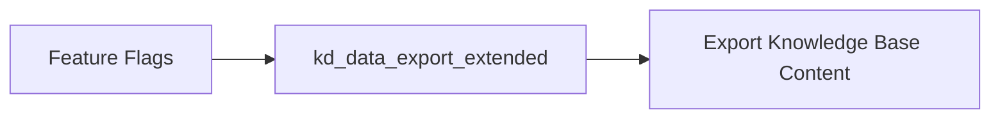
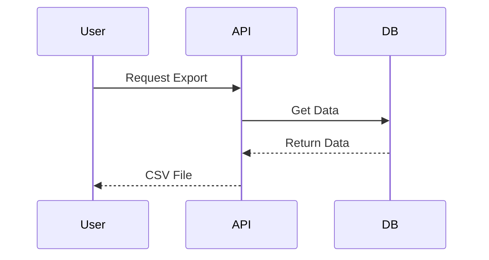
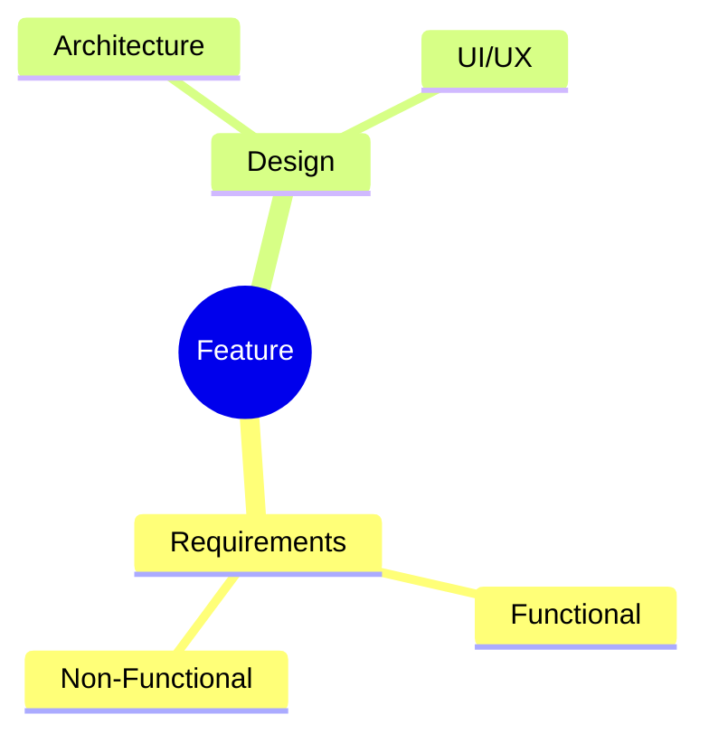
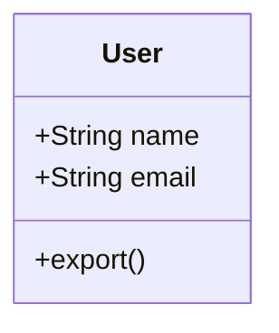
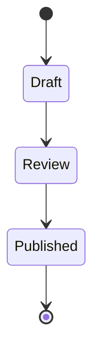
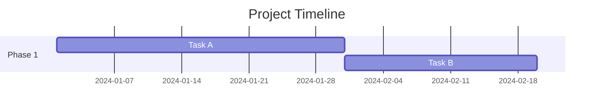
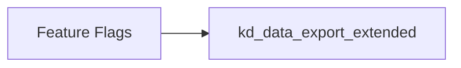

# Mejora: Soporte para Diagramas Mermaid en PRD Viewer

## Problema Resuelto

Los diagramas Mermaid en el PRD se mostraban como código en lugar de renderizarse visualmente:

```

```

## Solución Implementada

### 1. Instalación de Mermaid

```bash
npm install mermaid
```

### 2. Nuevo Componente: MarkdownRenderer

**Archivo**: `frontend/src/components/ui/MarkdownRenderer.tsx`

Este componente:
- ✅ Detecta bloques de código Mermaid (`\`\`\`mermaid ... \`\`\``)
- ✅ Los renderiza como diagramas visuales
- ✅ Mantiene el formato del resto del contenido markdown
- ✅ Usa tema oscuro para los diagramas (coherente con la UI)

#### Características del Componente

**Detección de Mermaid:**
```typescript
const mermaidRegex = /```mermaid\n([\s\S]*?)```/g
```

**Renderizado Asíncrono:**
```typescript
const { svg } = await mermaid.render(id, code)
wrapper.innerHTML = svg
```

**Tema Oscuro Personalizado:**
```typescript
mermaid.initialize({
  theme: 'dark',
  themeVariables: {
    primaryColor: '#60A5FA',      // Azul neón
    secondaryColor: '#8B5CF6',    // Púrpura
    tertiaryColor: '#14B8A6',     // Cyan
    background: '#1a1a2e',        // Fondo oscuro
    textColor: '#e5e7eb',         // Texto gris claro
  }
})
```

**Formateado Markdown Básico:**
- Headers (# ## ###)
- Texto en negrita (**texto**)
- Texto en cursiva (_texto_)
- Listas (- item)
- Líneas horizontales (---)
- Párrafos normales

### 3. Integración con PRDViewer

**Archivo**: `frontend/src/pages/PRDViewer.tsx`

Cambio simple:
```typescript
// Antes:
<pre className="whitespace-pre-wrap font-sans text-sm">
  {section.content}
</pre>

// Ahora:
<MarkdownRenderer content={section.content} />
```

## Tipos de Diagramas Soportados

Mermaid soporta múltiples tipos de diagramas:

### 1. Grafos de Flujo


### 2. Diagramas de Secuencia


### 3. Mindmaps


### 4. Diagramas de Clases


### 5. Diagramas de Estado


### 6. Diagramas de Gantt


## Resultado Visual

### Antes ❌
```

```

Se mostraba como texto plano.

### Ahora ✅

Se renderiza como un diagrama visual interactivo con:
- Nodos con colores del tema
- Flechas conectadas
- Texto legible
- Fondo oscuro coherente con la UI

## Beneficios

1. **Visualización profesional**: Diagramas renderizados en lugar de código
2. **Interactividad**: Los diagramas Mermaid son interactivos (zoom, pan)
3. **Consistencia visual**: Tema oscuro coherente con el resto de la UI
4. **Soporte completo**: Todos los tipos de diagramas Mermaid funcionan
5. **Fallback elegante**: Si hay error, mantiene el código original

## Estilos Aplicados

Los diagramas se renderizan en contenedores con estilo:

```typescript
className="mermaid-diagram bg-white/5 p-4 rounded-lg border border-white/10 overflow-x-auto my-4"
```

Esto proporciona:
- Fondo sutilmente visible
- Padding espacioso
- Bordes redondeados
- Scroll horizontal si el diagrama es muy ancho
- Espaciado vertical entre diagramas

## Manejo de Errores

Si un diagrama Mermaid tiene sintaxis incorrecta:
- Se registra el error en la consola
- Se mantiene el bloque de código original
- No rompe el resto del renderizado

```typescript
catch (error) {
  console.error('Error rendering mermaid diagram:', error)
  // Keep the original code block on error
}
```

## Testing

Para probar que funciona:

1. Navegar a un PRD que contenga diagramas
2. Abrir las secciones con diagramas (ej: "Appendix" o "Diagrams")
3. Verificar que se renderizan visualmente

## Performance

- **Lazy rendering**: Los diagramas solo se renderizan cuando se expande la sección
- **Memoización**: useEffect con dependencia en `content`
- **IDs únicos**: Cada diagrama tiene un ID único para evitar colisiones

## Archivos Modificados/Creados

- ✅ `frontend/src/components/ui/MarkdownRenderer.tsx` (nuevo)
- ✅ `frontend/src/pages/PRDViewer.tsx` (modificado)
- ✅ `frontend/package.json` (agregado mermaid)

## Extensiones Futuras

Posibles mejoras adicionales:

1. **Markdown completo**: Usar librería como `react-markdown`
2. **Syntax highlighting**: Para bloques de código no-mermaid
3. **Tablas**: Soporte para tablas markdown
4. **Links**: Hacer links clickeables
5. **Imágenes**: Soporte para imágenes embedded
6. **Export**: Botón para exportar diagrama como PNG/SVG

## Notas Técnicas

1. **Tema personalizado**: Los colores están alineados con la paleta de la app (neon blue, cyan, purple)
2. **Dark mode**: Configurado para tema oscuro por defecto
3. **Font size**: 14px para legibilidad
4. **Async rendering**: Los diagramas se renderizan de forma asíncrona para no bloquear la UI

## Estado

✅ **IMPLEMENTADO Y LISTO**
⚡ **Hot reload debería aplicar cambios automáticamente**

**Fecha**: 2025-12-10
