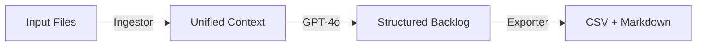

# 🚀 Haman Projects AI - The Engine

**Automated Backlog Generation from Unstructured Client Information**

Transform messy client notes, audio recordings, and documents into professional, Jira-ready backlogs using AI.

---

## 🎯 What It Does

This tool ingests unstructured information from clients (PDFs, audio files, text documents) and automatically generates:

1. **Jira-compatible CSV** with structured user stories, epics, and tasks
2. **Executive Summary** with project insights and sprint planning recommendations

---

## 📋 Prerequisites

- Python 3.9 or higher
- OpenAI API key ([Get one here](https://platform.openai.com/api-keys))

---

## 🛠️ Setup Instructions

### 1. Create Virtual Environment

```bash
python3 -m venv venv
source venv/bin/activate  # On Windows: venv\Scripts\activate
```

### 2. Install Dependencies

```bash
pip install -r requirements.txt
```

### 3. Configure API Key

```bash
# Copy the example file
cp .env.example .env

# Edit .env and add your OpenAI API key
# OPENAI_API_KEY=sk-your-actual-key-here
```

---

## 🚀 Usage

### 1. Add Input Files

Place your client files in the `inputs/` folder. Supported formats:

- **PDFs**: `.pdf`
- **Audio**: `.mp3`, `.wav`, `.m4a`, `.ogg`, `.flac`
- **Text**: `.txt`, `.md`

### 2. Run The Engine

```bash
python main.py
```

### 3. Get Your Backlog

Find the generated files in the `outputs/` folder:

- `jira_backlog_YYYYMMDD_HHMMSS.csv` - Import this into Jira
- `resumen_proyecto_YYYYMMDD_HHMMSS.md` - Read this for project insights

---

## 📊 Output Format

### CSV Columns (Jira-Compatible)

| Column | Description | Values |
|--------|-------------|--------|
| Issue Type | Type of ticket | Epic, Story, Task, Bug |
| Summary | Short title | Concise description |
| Description | Full details | User story + acceptance criteria (Markdown) |
| Priority | Importance | High, Medium, Low |
| Story Points | Effort estimate | 1, 2, 3, 5, 8, 13 (Fibonacci) |

### Description Format

Each story includes:

```markdown
Como [rol], quiero [acción], para [beneficio].

### Criterios de Aceptación
- [ ] Criterio 1
- [ ] Criterio 2
- [ ] Criterio 3
```

---

## 📁 Project Structure

```
hamann-ai-core/
├── inputs/              # Place client files here
├── outputs/             # Generated CSV and MD files
├── src/
│   ├── ingestor.py     # File reading & transcription
│   ├── brain.py        # GPT-4o integration
│   └── exporter.py     # CSV & MD generation
├── main.py             # Main orchestrator
├── requirements.txt    # Dependencies
├── .env.example        # API key template
└── README.md           # This file
```

---

## 🧪 Example Test Case

**Scenario**: Dog-walking app (like Uber for dog walkers)

1. Record a 2-minute audio describing the app:
   - "I want an app where dog owners can hire dog walkers"
   - "Owners should see GPS tracking in real-time"
   - "Payment with credit card"
   - "Walker profiles with ratings"

2. Save as `dog-walker-app.mp3` in `inputs/`

3. Run `python main.py`

4. Expected output:
   - Epic: "Dog Walking Platform"
   - Stories: GPS tracking, payment integration, user profiles, ratings system
   - Each with proper acceptance criteria and story points

---

## 🔧 Troubleshooting

### "OPENAI_API_KEY not found"
- Make sure you created the `.env` file (not `.env.example`)
- Verify your API key is correct
- Check that `.env` is in the project root

### "No supported files found"
- Verify files are in the `inputs/` folder
- Check file extensions are supported
- Make sure files aren't corrupted

### "Error transcribing audio"
- Audio files must be under 25MB
- Supported formats: mp3, wav, m4a, ogg, flac
- Check your OpenAI account has Whisper API access

### "Failed to parse JSON from GPT-4o"
- This is rare - try running again
- Check your OpenAI account has GPT-4o access
- Verify you have sufficient API credits

---

## 💡 Tips for Best Results

1. **Be specific in inputs**: The more detailed your client notes, the better the backlog
2. **Combine formats**: Use PDFs for requirements, audio for client calls, text for notes
3. **Review and refine**: The AI does 80% of the work - you do the final 20% refinement
4. **Start small**: Test with one simple project first to understand the output

---

## 🎓 How It Works



1. **Ingestor**: Reads PDFs, transcribes audio (Whisper), combines all content
2. **Brain**: Sends context to GPT-4o with expert Product Manager prompt
3. **Exporter**: Converts AI response to Jira CSV and executive summary

---

## 📝 License

Internal tool for Haman Software Factory.

---

## 🤝 Support

For issues or questions, contact the development team.

---

**Built with ❤️ by Haman Solutions**
