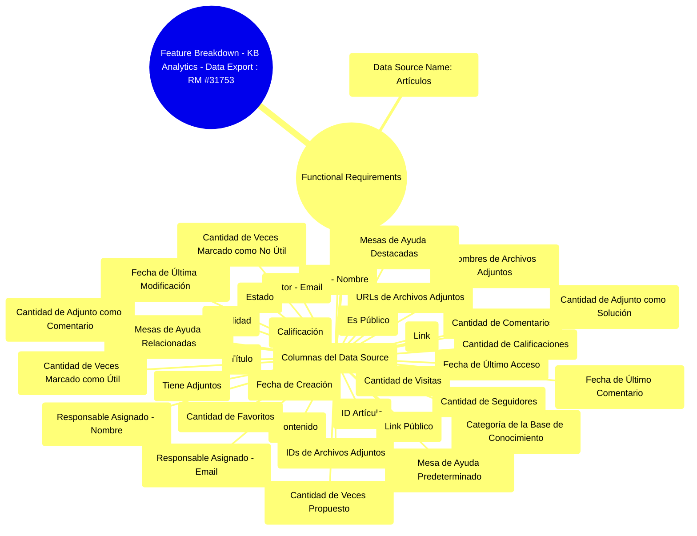

# KB Analytics - Data Export : RM #31753

_Product Requirements Document - Generated by Hamann Projects AI_

**Document Information:**
- **Generated**: 2025-12-10 21:43:05
- **Explicit Features**: Exportar los datos a Power BI, Excel, Looker u otras herramientas., Integrar los datos de la KB con otras fuentes de datos (solicitudes, agentes, etc)., kd_data_export_extended
- **Confidence**: 59%

---

## Table of Contents

1. [Business Context Brief](#business-context)
2. [Problem Definition](#problem-definition)
3. [Personas & Roles](#personas-roles)
4. [User Insights & Research Links](#user-insights)
6. [Solution Proposal (General Overview)](#solution-overview)
7. [Functional Requirements](#functional-requirements)
8. [UX & Flows](#ux-flows)
9. [Technical Requirements](#technical-requirements)
10. [Acceptance Criteria](#acceptance-criteria)
11. [KPIs & Metrics](#kpis-metrics)
12. [Risks & Challenges](#risks-challenges)
13. [Rollout Plan](#rollout-plan)
14. [Out of Scope](#out-of-scope)
15. [Appendix](#appendix)

---

## 1. Business Context Brief

### Business Context Brief

Actualmente, IGSM permite crear y gestionar artículos en su Base de Conocimiento, pero no ofrece visibilidad de la actividad y estado en el que están los mismos que pueda ser usada para analizar en profundidad su desempeño ni para generar reportes estratégicos fuera del sistema.

---

## 2. Problem Definition

### Problem Definition

- Medir el desempeño del conocimiento.
- Cuáles artículos se usan más/menos.
- Qué contenido está obsoleto o requiere actualización.
- Mejorar la gobernanza del conocimiento.
- Auditar quién crea, modifica o publica contenido.
- Revisar ciclos de vida y caducidad de artículos.
- Facilitar análisis avanzados y reporting.
- Exportar los datos a Power BI, Excel, Looker u otras herramientas.
- Integrar los datos de la KB con otras fuentes de datos (solicitudes, agentes, etc).

---

## 3. Personas & Roles

### Personas & Roles

**Principales:**

- **Mónica** – Directora de Operaciones. No puede evaluar el desempeño del conocimiento ni medir su impacto operativo en la resolución de solicitudes o en ticket deflection.

**Secundario:**

- **Federico** – Manager de un equipo resolutor. No sabe si su equipo consume o contribuye adecuadamente al conocimiento.
- **Lucía** – Agente de mesa de ayuda. Sufre las consecuencias de tener una KB desactualizada.

---

## 4. User Insights & Research Links

### User Insights & Research Links

**SUP-55805**  
El cliente necesita generar reportes de artículos creados y editados en determinados períodos de tiempo y ordenados cronológicamente.

---

## 6. Solution Proposal (General Overview)

### Solution Proposal (General Overview)

Esta propuesta busca ampliar esa capacidad mediante incorporar la opción de exportación de metadatos vinculados a la Base de Conocimiento.

---

## 7. Functional Requirements

### KB Analytics - Data Export : RM #31753

#### Functional Requirements

**Section Purpose:** Detailed functional specifications

- **Data source name:** Artículos. Esta nueva opción debe agregarse en el selector de fuente de datos.
- **Columnas del data source:**
  - ID artículo
  - Título
  - Link
  - Contenido
  - Autor (nombre)
  - Autor (email)
  - Responsable asignado (nombre)
  - Responsable asignado (email)
  - Fecha de creación
  - Fecha de última modificación
  - Categoría de la base de conocimiento
  - Estado
  - Visibilidad
  - Es público
  - Link público
  - Fecha de último acceso
  - Cantidad de visitas
  - Tiene adjuntos
  - IDs de archivos adjuntos
  - URLs de archivos adjuntos
  - Nombres de archivos adjuntos
  - Cantidad de calificaciones
  - Calificación
  - Cantidad de comentarios
  - Fecha de último comentario
  - Cantidad de favoritos
  - Cantidad de seguidores
  - Cantidad de adjunto como solución
  - Cantidad de adjunto como comentario
  - Cantidad de veces propuesto
  - Cantidad de veces marcado como no útil
  - Cantidad de veces marcado como útil
  - Mesa de ayuda predeterminado
  - Mesas de ayuda relacionadas
  - Mesas de ayuda destacadas

---

## 8. UX & Flows

### KB Analytics - Data Export : RM #31753

#### Section: UX & Flows

**Section Purpose:** User experience and interaction flows

La data se exporta en formato csv, y el usuario elige luego como utilizar dicha informacion. El flujo de importacion a las otras herramientas corre por cuenta del usuario.

---

## 9. Technical Requirements

### Technical Requirements

**Section Purpose:** Technical specifications and constraints

- **Feature Flags:** `kd_data_export_extended`  
  Habilita la posibilidad de exportar el contenido de los artículos en la base de conocimiento.

---

## 10. Acceptance Criteria

### Acceptance Criteria

**Exportación exitosa a csv**, con las columnas previamente definidas

---

## 11. KPIs & Metrics

### KPIs & Metrics

**Section Purpose:** Success metrics and KPIs

- `igsm_data_export_kb query / histograma`: Cantidad actual de data exports de KB por instancia.

---

## 12. Risks & Challenges

### Risks & Challenges

**Problemas de compatibilidad con herramientas externas**

---

## 13. Rollout Plan

### Rollout Plan

**Section Purpose:** Launch and rollout strategy

- **[Aplica si]** es un compromiso con: Banco Patagonia y Coppel sacarlo durante Q4 2025 / Q1 2026.
- **Milestones y Cronograma de lanzamiento:**
  - **Development Complete Date:** Sprint 229, Febrero 2026.
  - **Release Candidate Version:** 8.8.x.
  - **Tentative GA Date:** 2026-02-23 al 2026-03-06.

---

## 14. Out of Scope

### Out of Scope

Queda fuera del alcance, la posterior importacion de dicha data en herramientas externas.

---

## 15. Appendix

## Diagrams

### System Architecture

_Este diagrama muestra cómo el feature flag 'kd_data_export_extended' habilita la exportación del contenido de los artículos en la base de conocimiento._

### Feature Breakdown

_Diagrama de desglose de características para la exportación de datos de KB Analytics, detallando los requisitos funcionales y las columnas del data source 'Artículos'._

---

