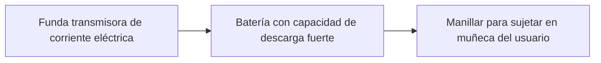
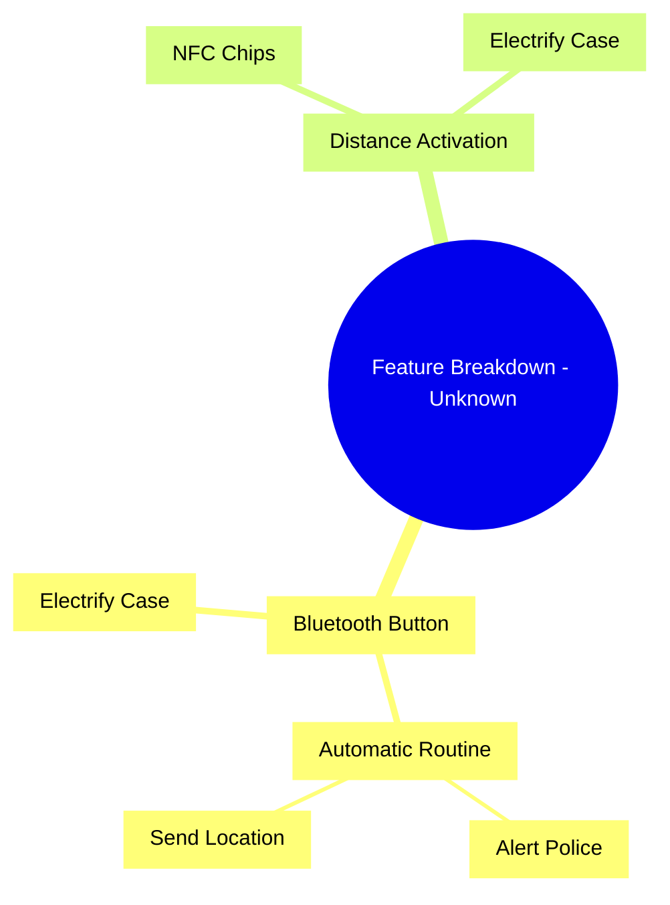

# Unknown

_Product Requirements Document - Generated by Hamann Projects AI_

**Document Information:**
- **Generated**: 2025-12-11 00:23:24
- **Explicit Features**: dispositivo Bluetooth a modo botón pulsador, electrificar la funda, funcionar a base de distancia, chips NFC implantados en formato subcutáneo, rutina automática al desconectarse del Bluetooth
- **Confidence**: 13%

---

## Table of Contents

1. [Business Context Brief](#business-context)
2. [Problem Definition](#problem-definition)
3. [Personas & Roles](#personas-roles)
5. [Opportunity & Market Analysis](#opportunity-analysis)
6. [Solution Proposal (General Overview)](#solution-overview)
7. [Functional Requirements](#functional-requirements)
8. [UX & Flows](#ux-flows)
9. [Technical Requirements](#technical-requirements)
10. [Acceptance Criteria](#acceptance-criteria)
11. [KPIs & Metrics](#kpis-metrics)
12. [Risks & Challenges](#risks-challenges)
13. [Rollout Plan](#rollout-plan)
14. [Out of Scope](#out-of-scope)
15. [Appendix](#appendix)

---

## 1. Business Context Brief

### Business Context Brief

**Propietarios del barrio privado:**

- Están sufriendo múltiples robos últimamente.
- Esto ayudaría a evitarlos.

---

## 2. Problem Definition

### El robo de celulares

---

## 3. Personas & Roles

### El usuario final

---

## 5. Opportunity & Market Analysis

### Opportunity & Market Analysis

**Market Opportunity:**

- Es bastante grande, potencialmente todos los barrios privados del país.

---

## 6. Solution Proposal (General Overview)

### Solution Proposal (General Overview)

La idea principal es algo similar a una pistola taser, en formato funda de celular.

---

## 7. Functional Requirements

### Functional Requirements

- Con un dispositivo Bluetooth a modo botón pulsador.
- Y cuando nos quitan el celu de la mano, podemos presionar el botón y así electrificar la funda.
- También puede funcionar a base de distancia.
  - Si el celu se distancia del pulsador, se activa automáticamente la electrificación de la funda.
  - Si vamos por el camino de activarlo con la distancia, se pueden utilizar chips NFC directamente, los cuales, en muchos casos podrán ser implantados en formato subcutáneo.
- Como plus, al desconectarse del Bluetooth, podemos activar una rutina automática, la cual puede alertar a la policía y enviar la ubicación en tiempo real a algún contacto o servicio de support.

---

## 8. UX & Flows

### UX & Flows

**Propósito de la Sección:** Experiencia del usuario y flujos de interacción

- Coloca en su celular, el dispositivo anti robo.
- Lo ajusta en su muñeca.
- Si en algún momento intentan quitárselo, se acciona el dispositivo anti robo y genera descarga eléctrica.

---

## 9. Technical Requirements

### Technical Requirements

- Funda transmisora de corriente eléctrica
- Batería con capacidad de descarga fuerte
- Manillar para sujetar en muñeca del usuario

---

## 10. Acceptance Criteria

### Acceptance Criteria

- Al intentar quitar el dispositivo de un usuario, se debe generar tal descarga eléctrica, que impida que el robo del mismo sea exitoso.

---

## 11. KPIs & Metrics

### KPIs & Metrics

**Cuantos descargas electricas se disparan por dispositivo**

---

## 12. Risks & Challenges

### Risks & Challenges

- **Legales**: puede considerarse daño a la propiedad ajena si se utiliza de mala manera.
- Alguna descarga involuntaria puede afectar al usuario dueño del dispositivo.

---

## 13. Rollout Plan

### Rollout Plan

**Entrega de los dispositivos en barrio provado a costo. Mostrando demos de funcionamiento en vivo**

---

## 14. Out of Scope

### Out of Scope

Por ahora, queda fuera de alcance el reporte a autoridades policiales.

---

## 15. Appendix

## Diagrams

### System Architecture

_Este diagrama muestra la arquitectura básica del sistema, donde la funda transmisora de corriente eléctrica está conectada a una batería con capacidad de descarga fuerte, y esta a su vez está conectada a un manillar para sujetar en la muñeca del usuario._

### Feature Breakdown

_Este diagrama desglosa las características funcionales relacionadas con el uso de un dispositivo Bluetooth y la activación por distancia para electrificar una funda de celular._

---

