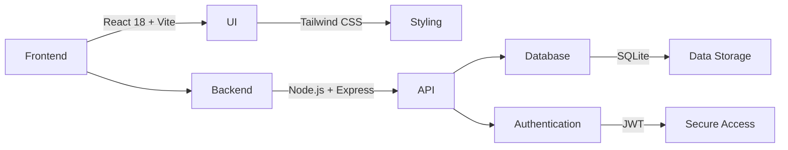

# Sistema de Gestión para Verdulerías “Apical & Don Rolo”

_Product Requirements Document - Generated by Hamann Projects AI_

**Document Information:**
- **Generated**: 2025-12-11 00:42:21
- **Explicit Features**: Autenticación y roles: login simple con JWT, Gestión de ingresos: monto + tipo de pago (efectivo, tarjeta, MP, transferencia), Gestión de egresos: monto + tipo(s) de pago, posibilidad de varios métodos combinados, Costos fijos: solo visibles y editables por el dueño, Reportes: resumen por local, por día y por tipo de transacción
- **Confidence**: 47%

---

## Table of Contents

1. [Business Context Brief](#business-context)
2. [Problem Definition](#problem-definition)
3. [Personas & Roles](#personas-roles)
4. [User Insights & Research Links](#user-insights)
5. [Opportunity & Market Analysis](#opportunity-analysis)
6. [Solution Proposal (General Overview)](#solution-overview)
7. [Functional Requirements](#functional-requirements)
8. [UX & Flows](#ux-flows)
9. [Technical Requirements](#technical-requirements)
10. [Acceptance Criteria](#acceptance-criteria)
11. [KPIs & Metrics](#kpis-metrics)
12. [Risks & Challenges](#risks-challenges)
13. [Rollout Plan](#rollout-plan)
14. [Out of Scope](#out-of-scope)
15. [Appendix](#appendix)

---

## 1. Business Context Brief

### Business Context Brief

**Product:** Sistema de Gestión para Verdulerías “Apical & Don Rolo”

**Section Purpose:** Strategic context and business rationale

- Es un negocio que cuenta con dos locales: Apical y Don Rolo.
- Ambos locales son gestionados por los mismos dueños, pero tienen diferentes cajeros, algunos proveedores son compartidos, otros no.
- La necesidad principal del cliente es poder obtener información relevante de viabilidad económica de ambos locales: ganancias, pérdidas, costos fijos, ganancias netas. Para así poder hacer proyecciones.

---

## 2. Problem Definition

### Problem Definition

- Falta de informacion de ingresos y egresos
- Falta de claridad en cuanto a cual es un buen dia del negocio
- Costos minimos que necesitan para mantener viable el local
- Punto de equilobrio del mismo

---

## 3. Personas & Roles

### Personas & Roles

#### Dueño / Administrador
- Acceso total a todas las funciones.
- Visualización de reportes diarios, mensuales y por local.
- Registro y edición de costos fijos (alquiler, servicios, salarios, etc.).

#### Cajero
- Carga rápida de ingresos (ventas) con tipo de pago.
- Carga de egresos (proveedores, sueldos, gastos diarios) con posibilidad de fraccionar medios de pago.
- Autoregistro de pago diario (sueldos).

---

## 4. User Insights & Research Links

### User Insights & Research Links

Actua,entne manejan un excel, el cual es enorroso, ya que previamente deben cargar todo en una nota de papel.

---

## 5. Opportunity & Market Analysis

### Opportunity & Market Analysis

**Market opportunity and competitive landscape**

Muy bajo, es para este cliente en particualar

---

## 6. Solution Proposal (General Overview)

### Solution Proposal (General Overview)

- Desarrollo integral MVP (frontend + backend + base de datos local)
- Incluye diseño mobile-first
- Funcionalidades completas para ambos roles
- Reportería básica

---

## 7. Functional Requirements

### Sistema de Gestión para Verdulerías “Apical & Don Rolo”

#### Functional Requirements

**Autenticación y roles:**
- Login simple con JWT.

**Gestión de ingresos:**
- Monto + tipo de pago (efectivo, tarjeta, MP, transferencia).

**Gestión de egresos:**
- Monto + tipo(s) de pago, posibilidad de varios métodos combinados.

**Costos fijos:**
- Solo visibles y editables por el dueño.

**Reportes:**
- Resumen por local, por día y por tipo de transacción.

**Dashboard mobile-first:**
- Navegación rápida, botones grandes e interfaz táctil intuitiva.

---

## 8. UX & Flows

### Sistema de Gestión para Verdulerías “Apical & Don Rolo”

#### UX & Flows

**Section Purpose:** User experience and interaction flows

- Se espera que tanto cajeros como admins puedan ingresar al sistema con usuario y contrasenia.
- Luego pueden ingresar a la seccion INgresos, egresos, cargar sueldo, o reportes.
- Estas debem estar en formato navbar.
- Ya que debe ser mobile first, pues es la forma en que los usuarios utilizan el sistem.

---

## 9. Technical Requirements

### Technical Requirements

**Frontend:**
- React 18 + Vite
- Tailwind CSS

**Backend:**
- Node.js + Express

**Base de datos:**
- SQLite (versión local)

**Autenticación:**
- JWT

**Diseño:**
- Mobile first + responsive (compatible con tablets y desktop)

---

## 10. Acceptance Criteria

### Acceptance Criteria

**Feedback el cliente, reporte de inconvenientes de los cajeros**

---

## 11. KPIs & Metrics

### KPIs & Metrics

- Uso de la plataforma
- Si hay movimientos diarios, quiere decir que se utiliza, y hay adopción.
- Que no hayan faltantes de ingresos y egresos de forma diaria.

---

## 12. Risks & Challenges

### Risks & Challenges

- Falta de adopción del sistema.
- Costos fijos elevados de hosting y db.
- Falta de mantenimiento.

---

## 13. Rollout Plan

### Rollout Plan

#### Etapas y plazos estimados:

1. **Diseño de arquitectura y setup inicial (frontend + backend + DB)** - 3 días.
2. **Módulos de ingresos y egresos (mobile)** - 4 días.
3. **Autenticación y control de roles** - 2 días.
4. **Costos fijos y reportes básicos** - 3 días.
5. **Pruebas, ajustes visuales y deploy local / demo** - 2 días.

**Duración total estimada:** 14 días hábiles.

---

## 14. Out of Scope

### Out of Scope

- Hosting / VPS / dominio / certificados SSL.
- Integración con sistemas de facturación o POS externos.
- Diseño gráfico avanzado (branding, UI personalizado más allá del MVP).
- Reportes avanzados (gráficos comparativos, dashboards BI).

---

## 15. Appendix

## Diagrams

### System Architecture

_Este diagrama representa la arquitectura del sistema de gestión para verdulerías, mostrando la relación entre el frontend, backend, base de datos y autenticación._




### Feature Breakdown

_Diagrama de desglose de características del sistema de gestión para verdulerías 'Apical & Don Rolo'._

```mermaid
mindmap
  root((Feature Breakdown - Sistema de Gestión para Verdulerías “Apical & Don Rolo”))
    Autenticación y roles
      Login simple con JWT
    Gestión de ingresos
      Monto + tipo de pago
        efectivo
        tarjeta
        MP
        transferencia
    Gestión de egresos
      Monto + tipo(s) de pago
      posibilidad de varios métodos combinados
    Costos fijos
      Solo visibles y editables por el dueño
    Reportes
      Resumen por local
      Resumen por día
      Resumen por tipo de transacción
    Dashboard mobile-first
      Navegación rápida
      Botones grandes
      Interfaz táctil intuitiva
```


---

